# Analysing .NET AsyncRAT using dnSpy

## Introduction
Hi all, Today we will be analysing .NET AsynRAT using dnSpy.In this blog we will be discussing about static extraction of the Config and we will also look at some of the capabilites of AsyncRAT. 

## Analysis
For readers who want to Follow along can get the sample from [MalwareBazaar](https://bazaar.abuse.ch/sample/8da2ee52332138905d6c21a8c2fd16c1ccb16aa057b64df7e66f2bd38664e86f/) .The sample was first Seen on 2023-07-04 07:07:39 UTC
. The sample is 32bit so you can use dnSpy 32 Bit Version. 

### Static Config Extraction

When You go to the Entrypoint function Main there is a method called **RBReueVXBVIYiq** which sets all the Config Data. If you take a closer look you can understand a pattern. 
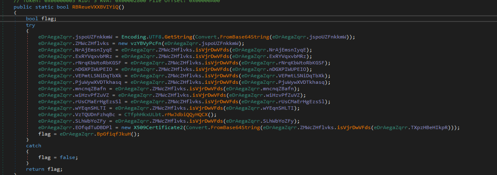
Most of the Config data is Set using the method **isVjrDwVFds** which takes a Field of **eDraegaZqrr**  as an Argument. When You look at  **isVjrDwVFds** it converts the argument from Base64 and call the method **QpLgTABIbRB** with the return value. Here is the actual decryption taking place. It uses AES CBC and SHA256 inside the decryption Function
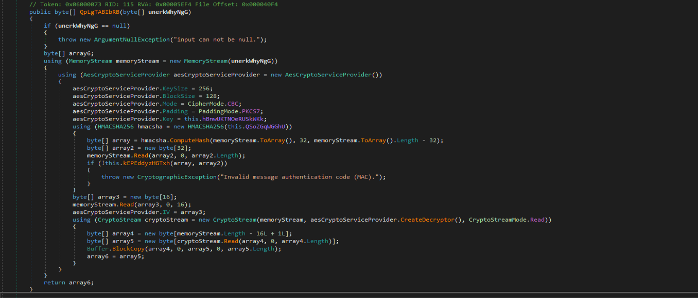
I tried using de4dot and Powershell to decrypt the config but they failed. So I tried to replicate the decryption function in Python
Steps I followed for decryption
1) Copy all the Content  from the **eDraegaZqrr** Class
2) Visit this [Cyberchef Recipie](https://gchq.github.io/CyberChef/#recipe=Regular_expression('User%20defined','%22(.*?)%22',true,true,false,false,false,false,'List%20matches')) and Paste the Contents of **eDraegaZqrr** Class . The Recipie uses  this regex "(.*?)" to Get the Value of the  fields from **eDraegaZqrr** 
3) Get the Config Extractor script from [here](https://github.com/irfan-eternal/blog_temp/blob/main/AzyncRAT/config_extract.py) and add the contents you got from Step2 as Elements of the array enc in main function and run the Script You will get all the Config Data  

```Python
import base64
from Crypto.Cipher import AES
from Crypto.Protocol import KDF
import hashlib
import hmac


def unpad(s):
    return s[:-ord(s[len(s)-1:])]
def decrypt(enc):
  enc = base64.b64decode(enc)
  password = base64.b64decode("W1h0cU9mc0E3S0VFcEt1Y3F4d1BkZTRMTk1vZ1A5aWY=");
  salt =  b'\xbf\xeb\x1e\x56\xfb\xcd\x97\x3b\xb2\x19\x02\x24\x30\xa5\x78\x43\x00\x3d\x56\x44\xd2\x1e\x62\xb9\xd4\xf1\x80\xe7\xe6\xc3\x39\x41'
  iteration  = 50000
  stream = hashlib.pbkdf2_hmac("shal", password, salt, iteration, dklen = 100)
  aeskey =  stream[:32]
  sha256key = stream[:62]
  HMACObject = hmac.new(sha256key, msg=enc[32:len(enc)-32], digestmod=hashlib.sha256)
  memoryStream = HMACObject.hexdigest()
  array2 = memoryStream[:32]
  iv =  memoryStream[32:48]
  encrypted_text= bytes(memoryStream[48:], 'utf-8')
  plain =  AES.new(aeskey, AES.MODE_CBC, bytes(iv, 'latin-1'))
  plain_text= unpad(plain.decrypt (enc))
  return plain_text[48:]

def main():
  enc  = []
  for i in enc:
      decrypted_text =  decrypt(i);
      print(decrypted_text)
      
 ```
 I tried de4dot and Powershell Scripts(Invoke) to decrypt the Config the Data but they failed. You can also decrypt the Config by debugging but you to need to pass all the Anti-Analysis checks

Next we will look at the Capabilities of the AsyncRAT Sample

### Anti-VM Technique

The Sample uses WMI Queries to check the manufacturer details and check if it contains VM related strings like VirtualBox, vmware, VIRTUAL . if this is the case the malware Exits
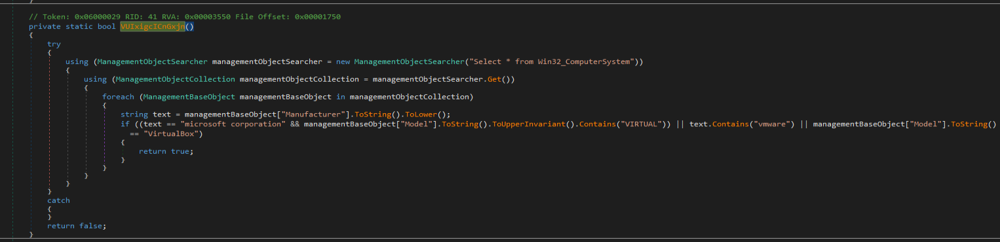

### Anti-Debugging Technique

The Sample get the current process handle and uses CheckRemoteDebuggerPresent API to Check if there is any remote Debugger is Attached to the Process . if this is the case The malware Exits
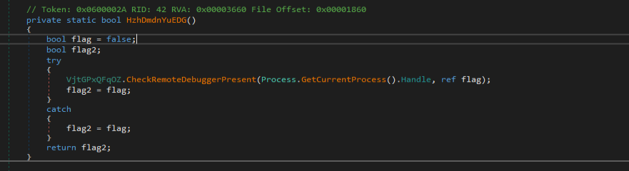

### Anti-Sandbox Technique

The Malware checks if it is Running in any Sandbox environment by Checking if SbieDll.dll is Loaded into process memory . This DLL is used by some [sandboxes](https://sandboxie-website-archive.github.io/www.sandboxie.com/SBIE_DLL_API.html). if SbieDll is present The malware Exits
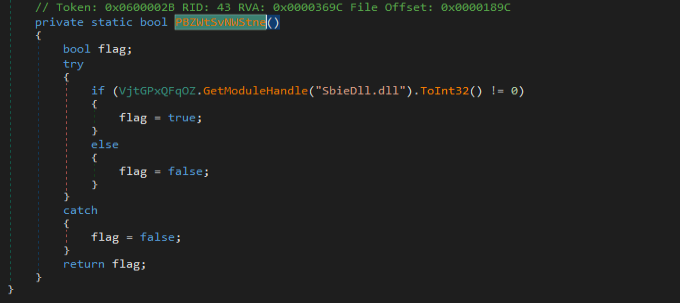

### Other Checks

It also Checks the Drive Size if the Size is less than the Hardcoded Value the Malware Exits

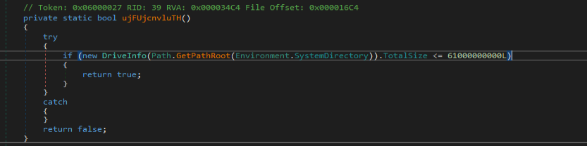

It Also Checks if the OSName contains XP if this is the case the Malware Exits
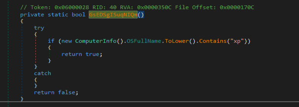


### Persistance

The Sample Checks whether it has Administrator privileges If yes it uses cmd to create a schedule task to achieve Persistance. If it is not an Administrator it uses the autorun key SOFTWARE\Microsoft\Windows\CurrentVersion\Run to achieve Persistance

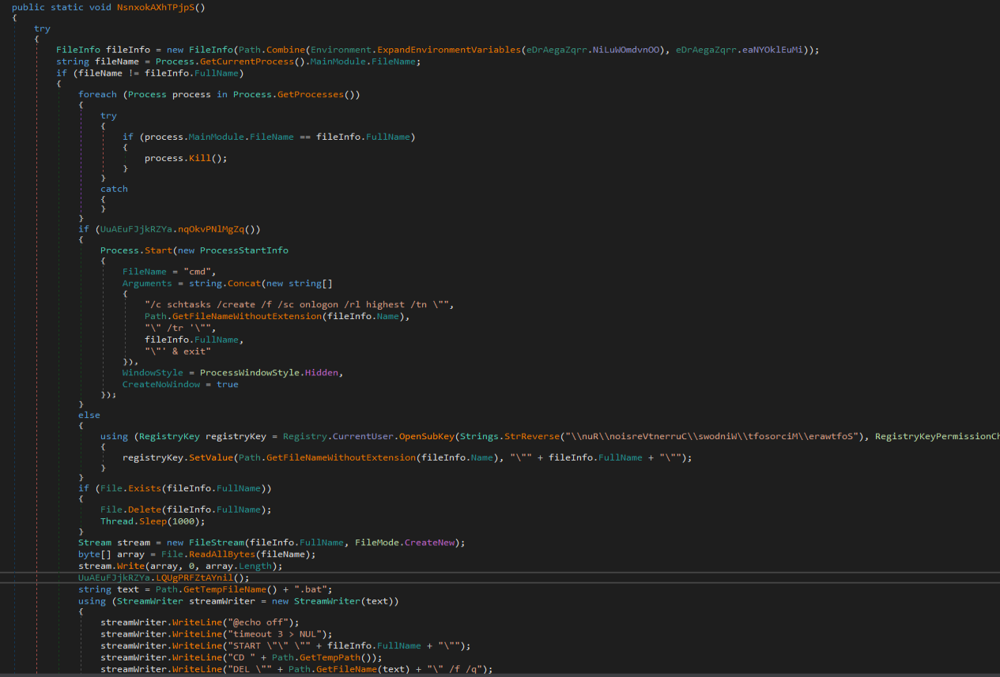

### Stop From Termination

If it has Adminstrator privileges it is given SeDebugPrivilege . By default, users can debug only processes that they own. By giving SeDebugPrivilege privilege it can debug processes owned by other users.  After that it uses RtlSetProcessIsCritical API  which  set the process to a system critical status. This means that the process is now "critical" to the running of Windows, which also means that on termination of the process, Windows itself terminates as well. 

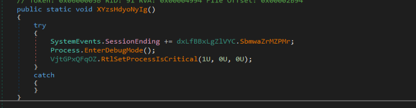

### Key Logging

It uses SetWindowsHookEx API to install a Hook procedure on all low level keyboard input Events. it stores the key logging data in %temp%log.tmp file and Exfilterates this Data

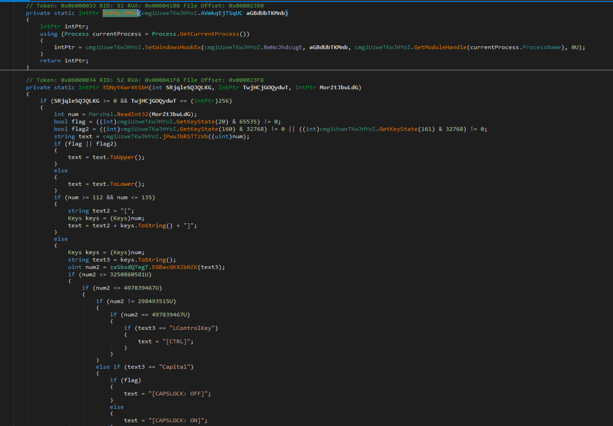


### Data Stealing and Exfilteration

It Collects Basic Information Like Username, OS, Executable Path, Anti Viruses etc. It Also Steals Data from Browsers like Firefox, Brave, Chrome, Opera, Edge. It Also Checks For Crypto  wallets like Binannce, Trust, MetaMask
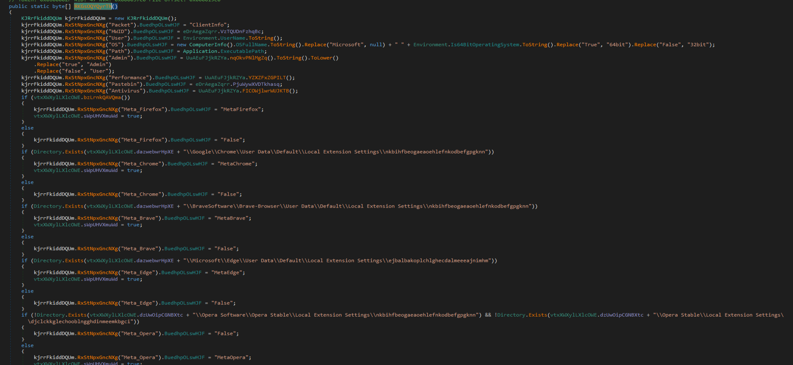


After Collection it Compresses the Data using GZip Stream and Exfilterates the Data to CnC josemonila[.]ddnsfree[.]com using Socket Class for CnC Communication
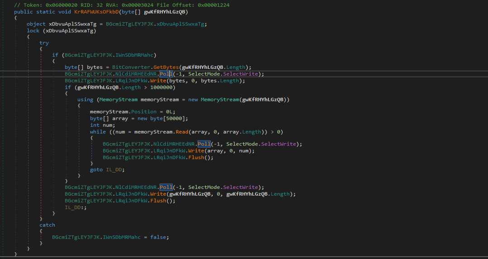


## Indicators of Compromise

| Type   | Indicator                                                        | Description                                                                 |
| ------ | ---------------------------------------------------------------- | --------------------------------------------------------------------------- |
| SHA256 | 8da2ee52332138905d6c21a8c2fd16c1ccb16aa057b64df7e66f2bd38664e86f | Initial File                                                                |
| CnC    | josemonila[.]ddnsfree[.]com                                      | Exfilteration of Data                                                       |
| Mutex  | AsyncMutex_6SI80kPnk                                             | To make sure to Run only once                                               |

## References

1) [Stackoverflow](https://stackoverflow.com/questions/12524994/encrypt-and-decrypt-using-pycrypto-aes-256) 
2) [codeproject](https://www.codeproject.com/Articles/43405/Protecting-Your-Process-with-RtlSetProcessIsCriti) 

 

