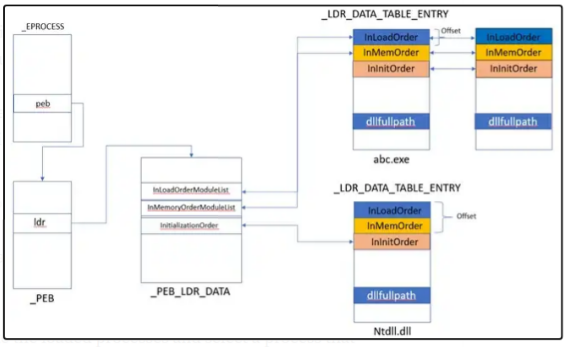
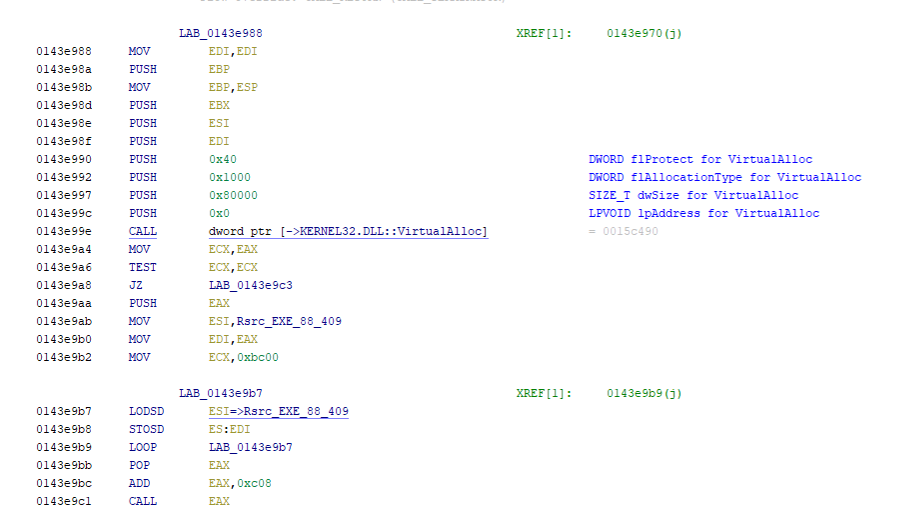
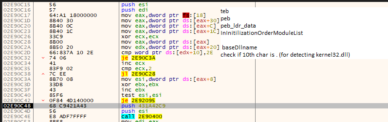
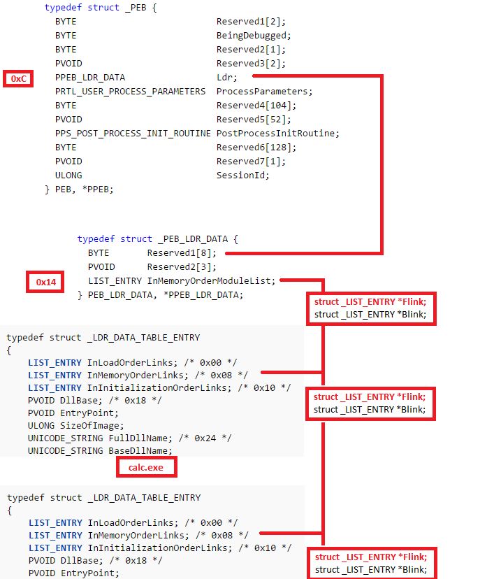
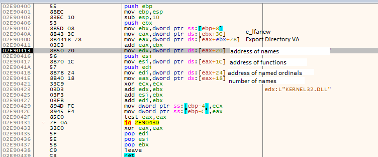
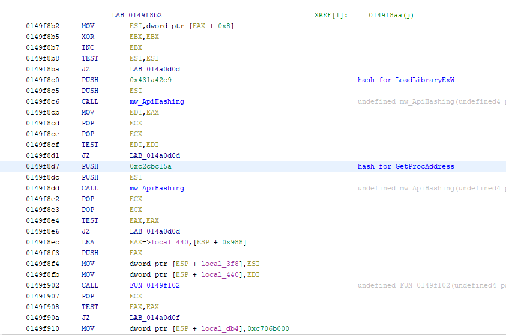
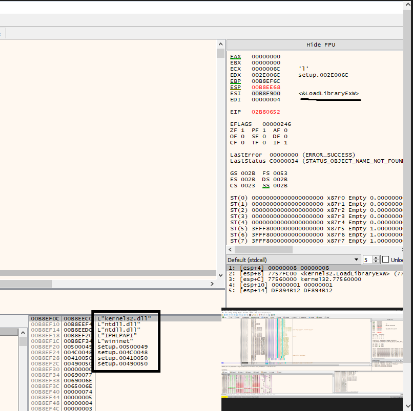

## Introduction
Hi all, Today we will be Analysing Shellcode to understand how they call windows API's. shellcode's are position independent, they do not have IAT to call API's. They normally walk the PEB(Process Environment Block).To understand theory on how PEB is used to get API's please read [this article](https://imphash.medium.com/windows-process-internals-a-few-concepts-to-know-before-jumping-on-memory-forensics-part-2-4f45022fb1f8) 
We will follow how a malware use this technique to call windows API's .

## Analysis

The malware First allocates memory and copies the shellcode from the rsrc section to the allocated memory

Then it gets the TEB (fs[18]) , after that it uses TEB to get the PEB (fs[30]). from the PEB it gets PEB_LDR_DATA ([PEB]+0c). from PEB_LDR_DATA  it gets InInitilizationOrderModuleList([PEB_LDR_DATA] + 1c). Then it gets the BsaeDLL name to check if 10th char is "." (for detecting kernel32.dll).This Data strucure is called LDR_DATA_TABLE_ENTRY. this table also contains other important Data like DLLBase, Entrypoint, SizeOfImage. To understand more about this Structures i would ask you to read [this article](https://securitycafe.ro/2015/12/14/introduction-to-windows-shellcode-development-part-2/) 

After getting  the DLLBase, we can get to e_lfanew(DLLbase+3c). From there we can go to the Exports Directory (DLLbase+ e_lfanew + 78).Exports Directory contains data Like  Address of names,Address of functions,Address of named ordinals,Number of names. These Data are used to Hash all the API"s and see if it Matches. You can refer [this site](http://www.sunshine2k.de/reversing/tuts/tut_pe.htm) to learn more about PE File format offsets 

An example of malware which uses the hashes of LoadLibraryExW and GetProcAddress to resolve them can be seen below

After this stack strings of DLL's are created and loaded using LoadlibraryExW

## References

1) [imphash](https://imphash.medium.com/windows-process-internals-a-few-concepts-to-know-before-jumping-on-memory-forensics-part-2-4f45022fb1f8) 
2) [securitycafe](https://securitycafe.ro/2015/12/14/introduction-to-windows-shellcode-development-part-2/) 
3) [sunshine2k.](http://www.sunshine2k.de/reversing/tuts/tut_pe.htm)

 
