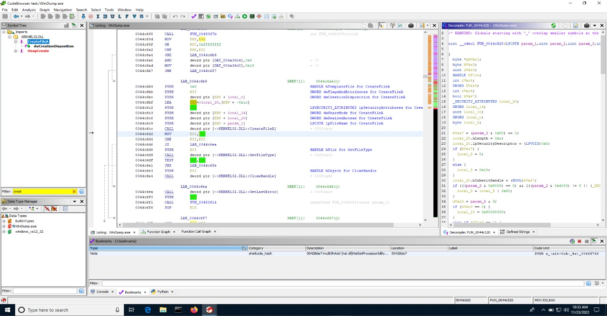

Hi all, Today I am writitng this post to let you know how i improved  My Ghidra GUI & Ghidra Skills. We will be  Discussing the below topics

1) Customizing Code Browser
2) Key Bindings
3) Ghidra Extensions
4) Ghidra Scripting

## Customizing Code Browser

Ghidra CodeBrowser has many Windows which helps in our analysis. My aim was to reduce switchig between Windows as less as possible. So I found the Windows i used the most and Combined them in the Main CodeBrowser Window.
The Sections in My CodeBrowser Windows are

1) Symbol Tree
2) Data Type Manager
3) Listing Window
4) Function Graph
5) Function Call Graph
6) Decompiler
7) Defined Strings
8) Console
9) Bookmarks
10) Python



I won't recommend you to use this Same Sections. Try to find the Windows you use the most and Combine them in the CodeBrowser. You Can add this Windows by Visiting Windows > "Windows you want to View". After that adjust them by dragging the Windows

Ghidra Lets you Cutomize the Code Browser by Visiting Edit > Tool Options.


An option which helped me a lot is Cursor Text Highlighting: 
1) Click Edit > Tool Options 
2) Under  Cursor Text Highlight select "Mouse Button to Activate" to  "LEFT" (This will highlight the occurence of a selected string in Listing/Decompiler Window)

## Key Bindings

Ghidra Key Bindings helps you to perform actions related to Ghidra. Ghidra Has So many default KeyBindings [Full List of Key Bindings](https://ghidra-sre.org/CheatSheet.html). Ghidra also help you to add custom Key Bindings by visiting Edit > Tool Options > Key Binding.
Here is a list of Key Bindings(Default + Custom) I use the most
1) L : Edit Label / Rename Function / Rename Variable
2) Ctrl + L : Retype Variable
3) T: Choose Data Type
4) X: Show Xrefs TO
5) Shift + [ = Create Structure
6) F3 = Edit Function Signature
7) C = Clear Code
8) D = Disassemble

Find the actions you perform the Most. look if there is a Key Binding for it. if not add a custom Key Binding. Setting Key Bindings for most used actions is a good practice


## Ghidra Extensions

Ghidra Extensions help you to import other features which are not in Ghidra. You can install a Ghidra Extension in GUI by going to Ghidra project Manager Window.
1) Click File → Install Extensions 
2) Click on the '+' icon in the Top right 
3) Select the folder Which Contain the Ghidra Extension 
4) After Importing Make sure Box under the Extension you want to install is Checked 
5) Click OK and Restart Ghidra

Find the Ghidra Documentation for extensions [Here](https://ghidra-sre.org/InstallationGuide.html#Extensions) .These are the Two Extensions i have found usefull

1) [Ghidrathon](https://github.com/mandiant/Ghidrathon) : The FLARE team's open-source extension to add Python 3 scripting to Ghidra.
2) [Kaiju](https://github.com/certcc/kaiju) :  Kaiju is a binary analysis framework extension for the Ghidra software reverse engineering suite

## Ghidra Scripting

Ghidra Supports Scripting in multiple languages. I use python for scripting in Ghidra. Ghidra API is very powerfull that we can replace a Multiline code with a single Ghidra API function Call.I will Show some of the Cool Ghidra API Functions Belw

1) find(Address addr, byte[] values) : Searches memory from 'addr' for 'values' and returns the address of 'values' if it is found
2) getBytes(Address addr, int length) : Return 'length' bytes from memory starting from 'addr'
3) getReferencesto( Address addr) : Get All the XREF's to addr
4) setEOLComment(Address addr, String message): Add an EOLComment at 'addr' which has the comment 'message'
5) createBookmark(Addres addr, String category, String note): Creates a NOTE bookmark at 'addr'
6) toAddr​(String addressString)	: Returns a new address inside the specified program as indicated by the 'addressString'.


This the just a tip of the iceberg. There so many other Functions in the Ghidra API . Refer [this](https://ghidra.re/ghidra_docs/api/ghidra/program/flatapi/FlatProgramAPI.html) for more details

Here is a Ghidra Script i wrote to Decrypt an XOR encrypted Sring table

```python
from ghidra.app.decompiler import DecompileOptions
from ghidra.app.decompiler import DecompInterface
from ghidra.util.task import ConsoleTaskMonitor

def decrypter(data_string, data_key):
    decoded = ''
     for i in xrange(0, len(data_string):
         decoded += chr((data_string[i]) ^ (data_key[i % len(data_key)]))
         return decoded


enc_address_start = askAddress("Provide Address of Encrypred String", "Address")
enc_address_end  = find(enc_address_start, [00, 00]) 
len_address = int(str(enc_address_end), 16) - int(str(enc_address_start), 16)
data =  getBytes(enc_address_start, len_address) 
key_address_start = askAddress("Provide Address of Key String", "Address")
key_address_end = find(key_address_start, [00, 00])
len_address_key = int(str(key_address_end), 16) - int(str(key_address_start), 16) 
key = b''
key = getBytes(key_address_start, len_address_key)
global decoded
decoded = decrypter(data, key)
mw_decrypt = askAddress("Provide Address of decrypt function", "Address")
refs =  getReferencesTo(mw_decrypt)
options = DecompileOptions() 
monitor = ConsoleTaskMonitor()
ifc = DecompInterface() 
ifc.setOptions(options)
ifc.openProgram(currentProgram)
for xref in refs:
    i = xref.getFromAddress()
    func = getFunctionContaining(i)
    res =  ifc.decompileFunction( func, 60, monitor)
    high_func = res.getHighFunction() 
    pcodeops = high_func.getPcodeOps(i)
    op = pcodeops.next() 
    print(str(i))
    param = op.getInputs()
    offset = str(param[1]).split(",")
    offset_1 = offset[1]
    offset_int = int(offset_1.lstrip(), 16) 
    decrypted_string = decoded[offset_int:].split("\x00")[0]
    print(decrypted_string)
    setEOLComment (i, decrypted string)
```

## References
1) [The Ghidra Book](https://www.amazon.com/Ghidra-Book-Definitive-Guide-ebook/dp/B0852N9Y4Q)
2) [exploitreversing](https://exploitreversing.com/2022/02/03/malware-analysis-series-mas-article-2/)
3) [Awesome Ghidra](https://github.com/AllsafeCyberSecurity/awesome-ghidra)
4) [Matthew](https://twitter.com/embee_research)


