## Introduction
In this blog we will be discussing about  Understanding Internals of SmokeLoader using Ghidra

## Analysis
For readers who want to Follow along can get the sample from [MalwareBazaar](https://bazaar.abuse.ch/sample/5c1735b8154391534f98e6399a2576a572c7fd3c51fa6ecc097434c89053b1f7/) .The sample was first Seen on September 5th 2023 14:12:29 UTC
. The sample is 32bit Exe File You can use the tool of your Choice i will be using Ghidra in this blog. The Sample Consists of 3 Stages.  In the next sections we will look at each Stages in Detail

## Stage 1

The Primary Job of Stage 1 is to Write a new Image to Memory which is the Second Stage

### Shellcode Allocation and Calling


The Stage 1 Allocates a Executable Memory in Virtual address space using VirtualAlloc. Writes Shellcode to this address space whose job is to Load the new Image in to Memory
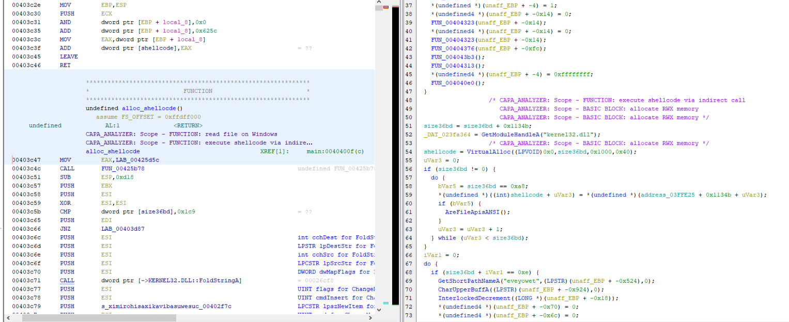
It Calls the Shellcode from Address **40404a** If you want to Dump this Shellcode and Understand What it is doing you Can put a Breakpoint on this Location . Stepin to this Call and dump this portion or Follow it in Debugger to Understand What it's doing
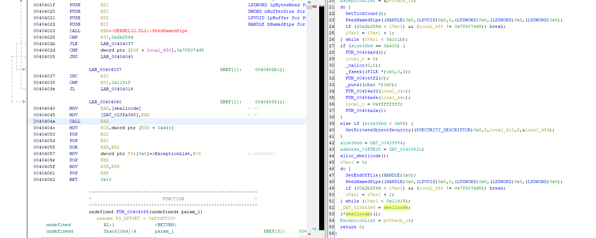


### Loading New Image to Memory

The Shellcode first Dynamically Resolves API Call. It uses StackStrings and GetProcAddress to do this
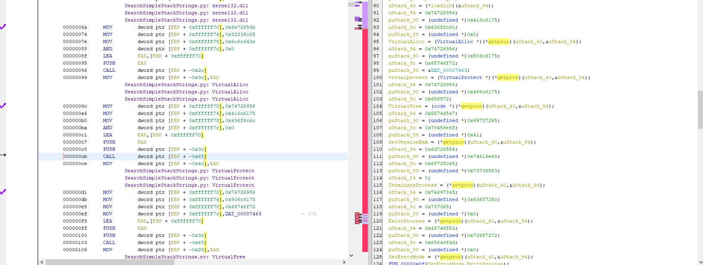
Using the Dynamically Resolved API Calls it Loads the New Image to Memory by Parsing PE Headers. If you have a good Understaing of PE File Formats and it's offsets the below image will make Sense to you
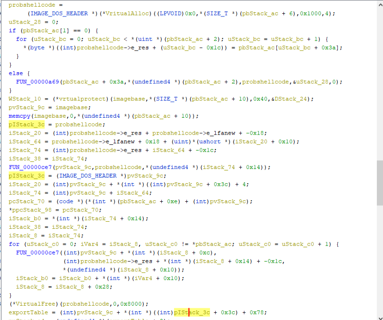

Some PE File Format offsets i want you take a note is 0x3c and 0x78 . Offset 0x3c is aslo called as e_lfanew it is the File address of new exe header .e_lfanew* + 0x78 gives us the ExportDirectory Virtual Address

After this Shellcode is Comletely executed the New Image will be Loaded in the Memory. You can dump the Second stage from memory Now

## Stage 2

Stage 2 is Very Obfuscated Stage with Multiple Anti-Analysis Techniques to Frustrate the Malware Analyst working on it. It Includes Anti-Vm Checks, Encrypted Function code only Decrypted prior to it's execution, API Hashing etc... The Final Goal of this Stage is to Inject the Third Stage to explorer.exe

### Weird Conditional Jumps

This Stage Contains Weird Conditional Jumps as Show in the below image . They are JNZ and JZ jumps with same Destination Address. This is Infact an Unconditional Jump. The Malware is using this technique make it hard for the Disassembler and Decompiler


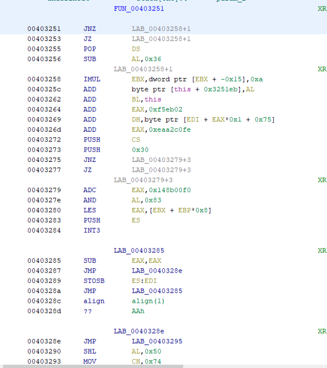


We can Fix this Easily by finding all the Places with this weird Conditional Jumps and patching it with unconditional Jump.

```
def handleDoubleConditionalJumps():
    address_array = findBytes(currentProgram.getMinAddress(), b'\x75.\x74.', 1000)
    address_array += findBytes(currentProgram.getMinAddress(), b'\x74.\x75.', 1000)
    for addr in address_array:
        jmp_bytes = getBytes(addr, 4)
        if jmp_bytes[1] - jmp_bytes[3] == 2:
            clearListing(addr)
            dis.disassemble(addr, None)
            patch_instruction = bytearray()
            patch_instruction.append(0xeb)
            patch_instruction.append(jmp_bytes[1])
            patch_instruction.append(0x90)
            patch_instruction.append(0x90)
            patch_instruction2 = bytes(patch_instruction)
            clearListing(addr)
            clearListing(addr.add(2))
            clearListing(addr.add(3))
            block = mem.getBlock(addr)
            block.putBytes(addr,patch_instruction2 )
            dis.disassemble(addr, None)
            jmp_instr = getInstructionAt(addr)
            new_jmp = jmp_instr.getDefaultFlows()[0]
            new_jmp2 = new_jmp
            for i in range(50):
                 clearListing(new_jmp2)
                 new_jmp2 = new_jmp2.add(1)
                 if new_jmp2.getAddress == currentProgram.getMaxAddress():
                     break
```
The Above Python Code does this using Ghidra API After we run this Script all the Weird Conditonal Jumps will be patched to Unconditional jumps and Disasseblers and Decompilera will give us a Better Output. The Below images Shows us the Sample after Execution of th Script
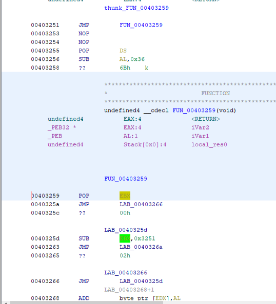


### Control Flow Obfuscation

This stage's Control Flow is Obfuscated with the use of Anti-Debugging Checks

In the Below Image malware uses PEB's  BeingDebugged Field (Offset 0x2) to Check if Process is Being Debugged. If it's not being Debugged the Offset will contain 0, which is used to Calculate the address where the Control flow is Transfered. If the process is being Debugged the Offset will Contain 1 and will lead to Exception

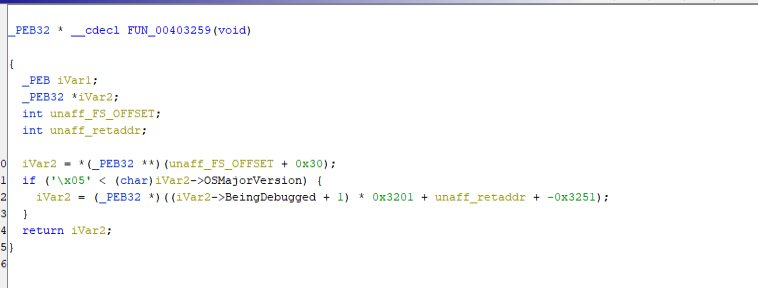

An other Anti-Deugging Technique it uses is the NtGlobalFlag Field( offset 0x68) in the PEB to Check if it's Being Debugged.  If it's not being Debugged the Offset will contain 0, which is used to Calculate the address where the Control flow is Transfered. If the process is being Debugged the Offset will Contain 0x70  and will lead to Exception


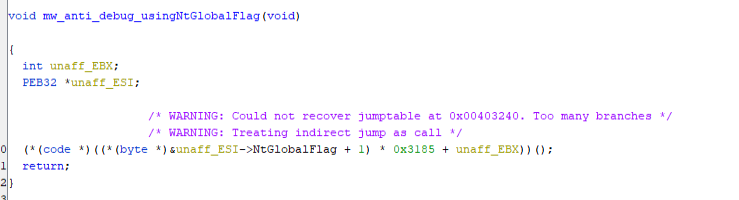


### Encrypted Function Code

One of the most distinctive feature about SmokeLoader is that most of the Function code are in the Encrypted form. They will only be Decrypted just before execution of that code. And will be re-encrypted after that code has been executed

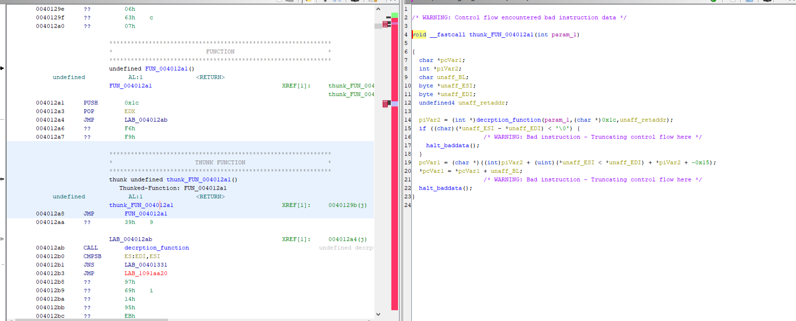

The above image show an Example how the Code look like before Encryption

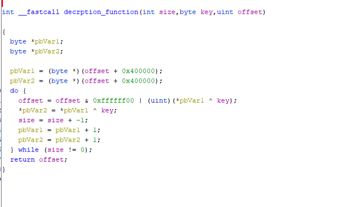

The decryption_function in the above image is the function which decrypts the Code. It is a normal XOR Decrption. The Function takes three parameters. 
1) Size of the code to be decrypted
2) XOR Key used
3) RVA of the Starting of the Code that need to be decrypted. You can use the below function to Decrypt one function at a time

```
def decryptShellcode(size, xor_key, rva):
    va = rva + 0x400000
    va = hex(va)[2:]
    addr = toAddr(va)
    addr2 = addr
    enc = get_bytes(toAddr(va), size)
    for i in range(size):
            clearListing(addr2)
            addr2 = addr2.add(1)
    size2 = size
    for i in range(0,size):
        enc[i] = enc[i]^xor_key
        
            
    for i in enc:
       i = i & 0xFF
       setByte(addr, i)
       addr = addr.add(1)

```
The Below Image Shows the same code after Decryption. The last call to 40131a is wrapper for decryption_function, which will cause the code to be re-encrypted
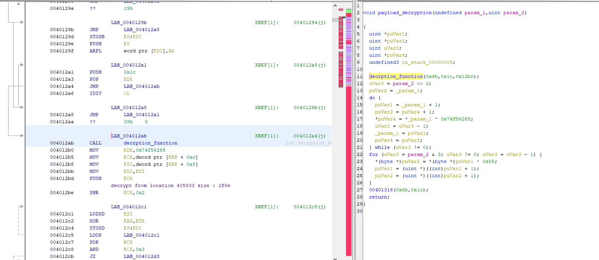

### API Hashing

The Hashing Algorithm used in 2nd Stage is DJB2 hasing Algorithm. In the below image you can see the decompiled code for this. If you are having trouble Understanding this Code i would ask you to read [this blog](https://irfan-eternal.github.io/analysing-shellcode-to-understand-how-they-call-windows-apis/) . It Explains in Detail about API Resolving

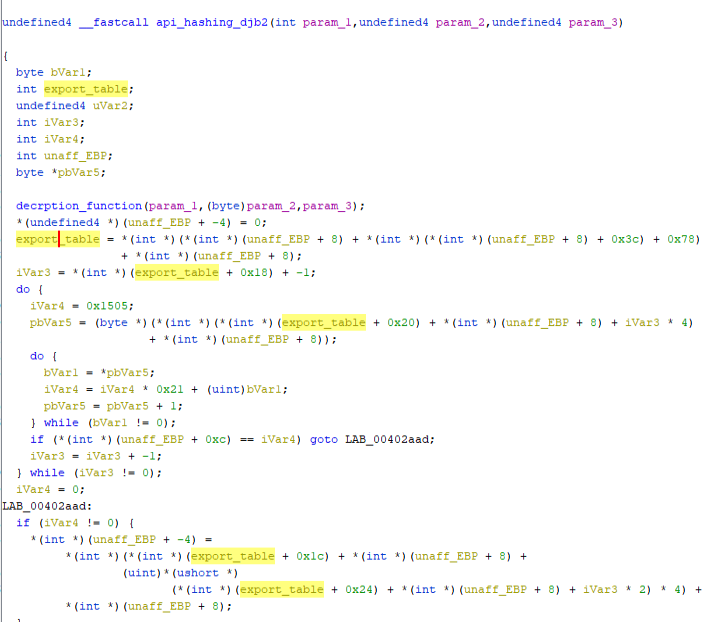

You can use the below python function to find the values of hashes of the API's you need.

```
def api_hashing():
    api_list = []
    hasher = 0x1505
    hash2 = 0
    for a in api_list:
            hasher = 0x1505
            hash2 = 0
            for i in a:
                i = ord(i)
                hash2 = hasher
                hasher = hasher << 5
                hasher = hasher & 0xFFFFFFFF
                hasher = hasher + hash2
                hasher = hasher & 0xFFFFFFFF
                hasher = hasher + i
                hasher = hasher & 0xFFFFFFFF
            
            hash2 = hasher
            hasher = hasher << 5
            hasher = hasher & 0xFFFFFFFF
            hasher = hasher + hash2
            hasher = hasher & 0xFFFFFFFF
        
           
            hasher2 = hex(hasher)[2:-1]
            if len(hasher2)!= 8:
                hasher2 = "0"+hasher2
                
            
            print("API Name : "+a+" Address : "+addresss)
                    
```

### Checks KeyBoard Layout

Next the malware checks the keyboard layout of the device. If it's Russian(0x419) or Ukranian(0x422) the malware won't do any malicious activites. If this is not the case it continues doing it's Buisness

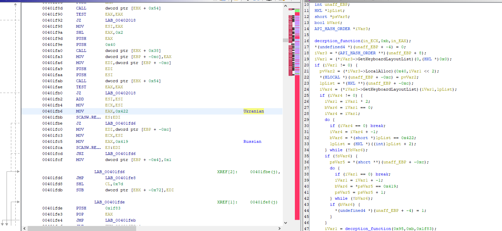

###  Previliges Check

The Malware Check if it's running with Higher Previliges using this API Call's OpenProcessToken -> GetTokenInformation(TokenIntegrityLabel) -> GetSidSubAuthority
It is Checking if the Integrity level is above  0x2000 (SECURITY_MANDATORY_MEDIUM_RID )
If the values greater than 0x2000, it is  high integrity. If the user is local admin, but a process was executed normaly, you have the medium integrity Level. If the user clicks run as administrator you would have 0x3000.

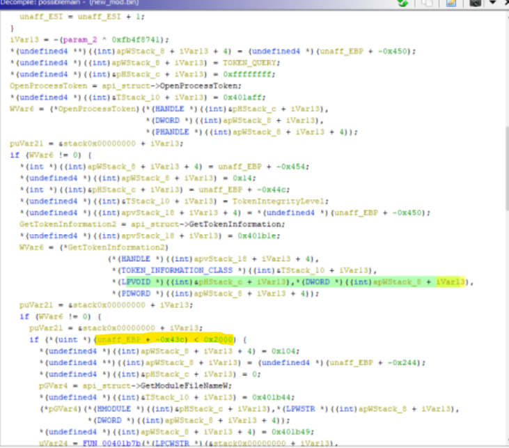

If this is not the Case it will use Run As Administrator Option to get Higher privileges

### API Resolving for APIs of NTDLL

The Malware Then Open's a handle ntdll.dll with shareMode set to 0,Creates a file mapping object for ntdll, Maps a view of this file mapping into the address space of the Malicious process and does API resolving using the Same Hash Algorithm (djb2) in this mapped View. This is to make sure no APIs are being hooked by EDR

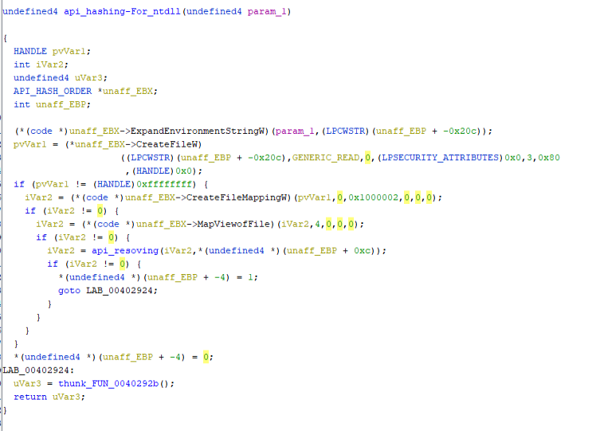

### Anti-Sandbox, Anti-Emulator and Anti-VM Techniques

The Malware has Multiple Checks to detect if it's in a VM or sandbox. In the below Image malware is checking if the dlls sbidedll(Sandboxie), aswhook(Avast) and snxhk(Symantec) are mapped into malicious process address space. These DLLs are related to Sandbox solution or Anti-Virus products, another interesting thing to note is that the arguments are stored in the return adress of the function

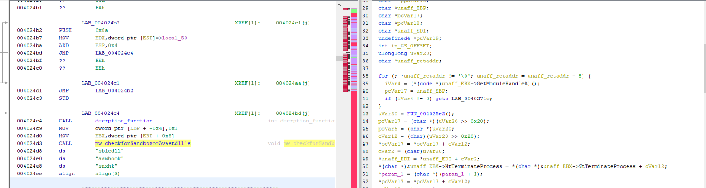


Another check used by the malware is to check  in the Registry Tree for device and drivers  if it contains anything related to Virtual machines. It Opens the Registry keys SYSTEM\CurrentControlSet\Enum\IDE and SYSTEM\CurrentControlSet\Services\Disk\Enum\SCSI using NtOpenKey and gets and the number and sizes of its subkeys using NtQueryKey

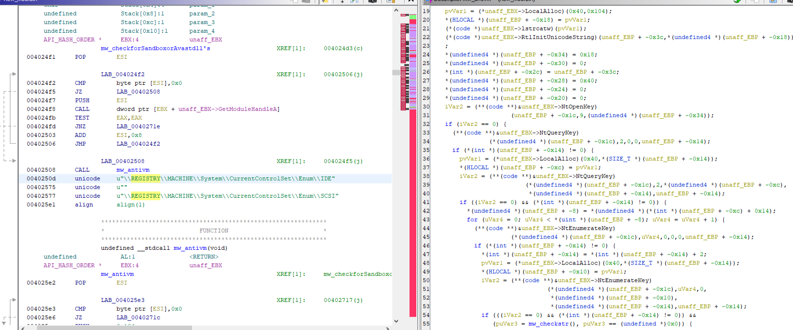

It then uses NtEnumerateKey to get the information about the subkeys and check if this subkeys contains the strings qemu, virtio, vmware, vbox, xen . These strings are related to Emulators and Virtual Machines

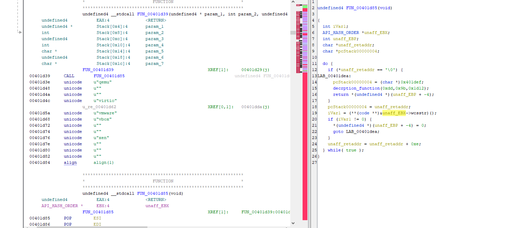

The Next check it uses is to detect Emulators . It Checks Current Process' File path with AFEA.vmt using wcsstr this is a Technique called error-based anti-sandbox check.  It is explained in detail by herrcore in [this video](https://www.youtube.com/watch?v=8jckguVRHyI)

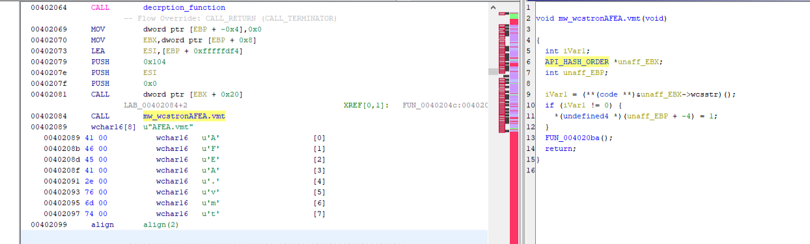


### Injection of Third Stage using Heavens Gate Technique

The Malware First Checks if it's running on a 64 bit or 32 bit System by looking at the GS Register because GS is non-zero in Win64 and  In a 'true' 32 bit Windows GS is always zero.. If it's running on a 64 bit System it uses Heavens Gate technique .“Heaven's Gate” is a technique used to run a 64-bit code from a 32-bit process, or 32-bit code from a 64-bit process   .To know more about this technique I request you to refer [this article](https://0xk4n3ki.github.io/posts/Heavens-Gate-Technique/)

Here it is used to run 64-bit code from a 32-bit process for Injection of the Third Stage. If the System only supports 32 bit it Executes the Code shown in the Below Image

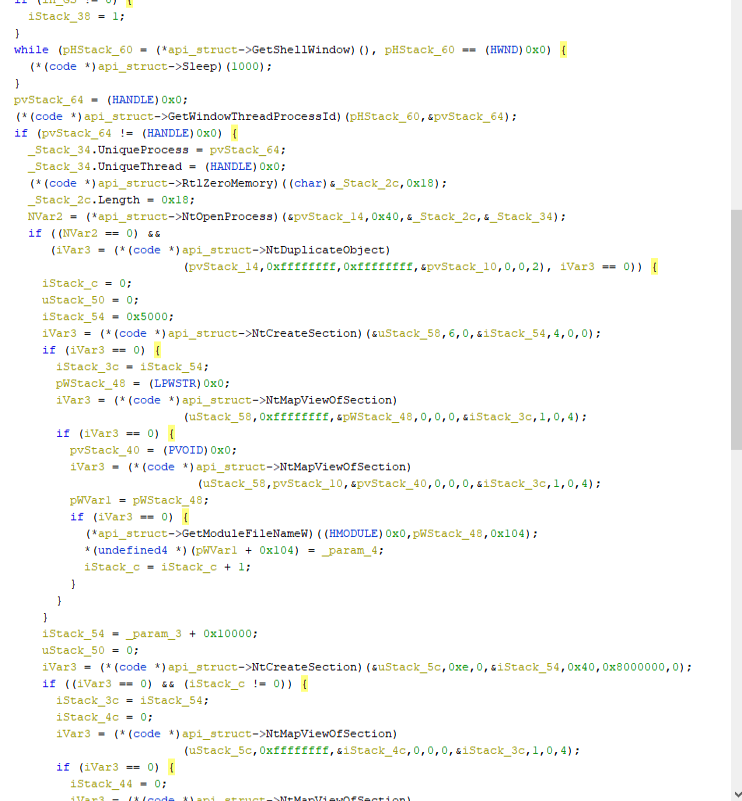

The third Stage is injected to explorer.exe. It uses GetShellWindow and GetWindowThreadProcessId to get the process ID of explorer.exe. It then uses NtOpenProcess and NtDublicateObject to create a duplicate handle for explorer.exe. It then creates a section then Maps the same section to malicious process and explorer.exe. Another section is also created and this process is again repeated. The third stage is then written to this section in the malicious Process. Since explorer.exe also has the same section mapped it will also have the third Stage in it's Memory.

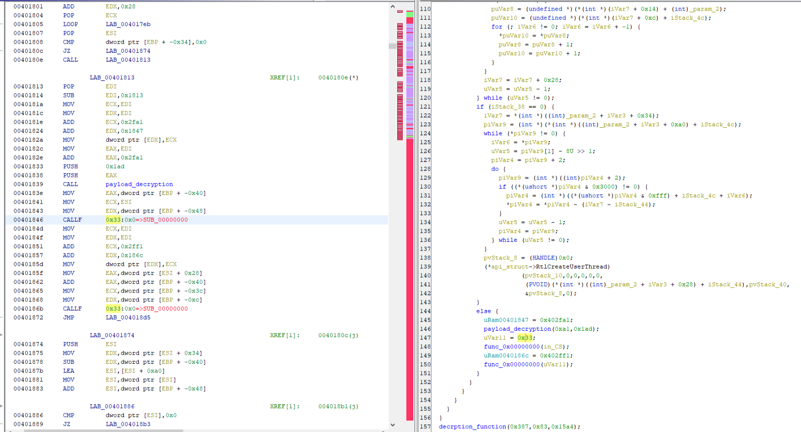

Then RtlCreateUserThread is used to Execute the Malicious third stage from explorer.exe's address space

if the System supports 64 bit. It Decrpyts the 64 bit code for Injection and uses heaven's gate technique technique to excecute this. The process of Injection is same for Both. In the below images you can see the 64 bit code which  dynamically resolves RtlCreateUserThread API and it is then used to Execute the malicious third stage from explorer.exe's address space


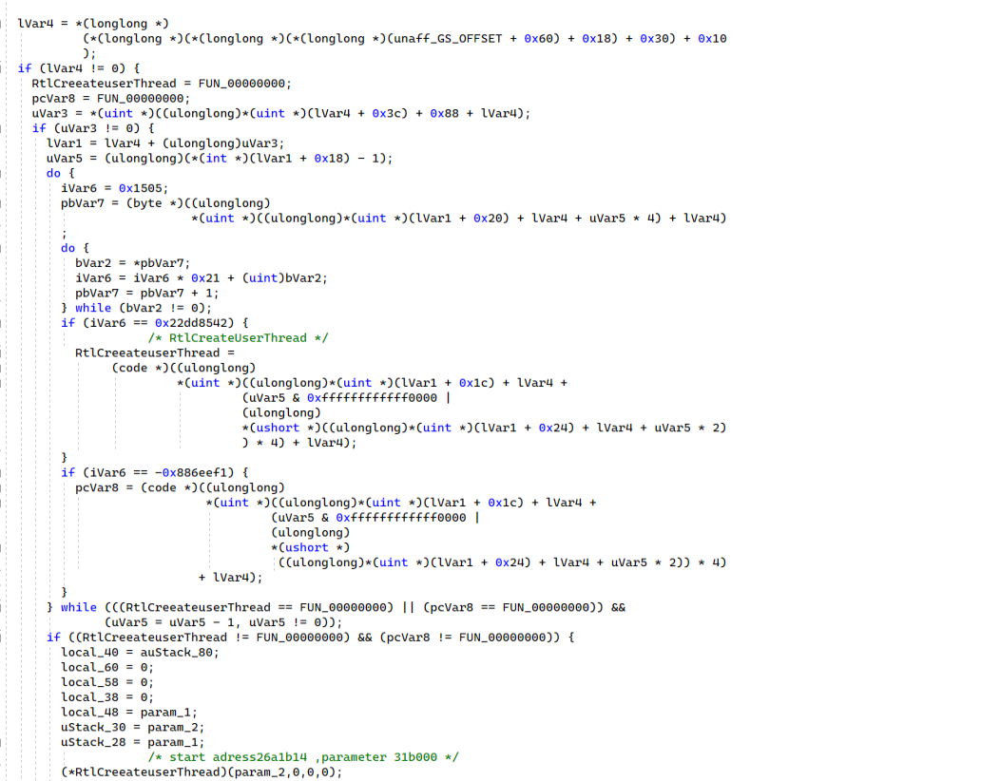

To get the third stage you can set the GS register to 0 in the debugger at the time of injection, set shareMode to FILE_SHARE_READ (0x00000001) when opening handle to ntdll.dll and defeat all the Anti-Analysis techniques mentioned to get the third Stage in explorer.exe and dump it. You can aslo get the entrypoint of the function if you look at the parameters of the RtlCreateUserThread


## Stage 3

The Main objective of this stage  is to Decrypt C2 URl Communicate to C2  and Download the Final payload. This stage is also responsible for Persistnace of the Malware

### Dynamic API Resolving using API Hashing

Third stage of the malware has a Different set of API resolving . it uses ROL8 hashing you can see the algorithm in the below image

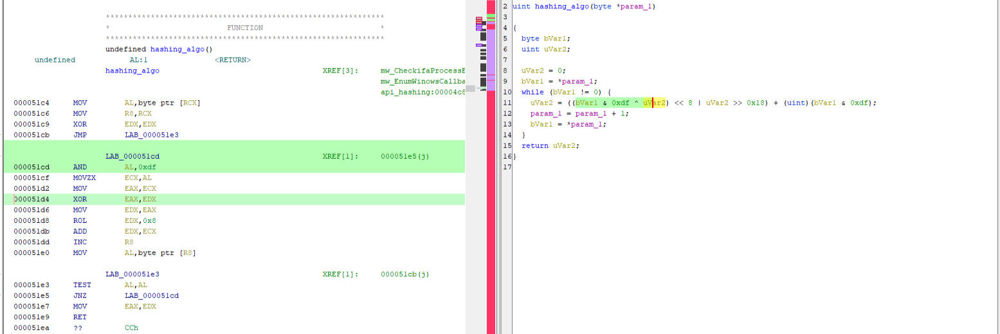

It uses this Hashing Algoritm to resolve APIs in multiple DLLs' (kernel32, ntdll, user32, advapi32, ole32, winhttp and dnsapi)

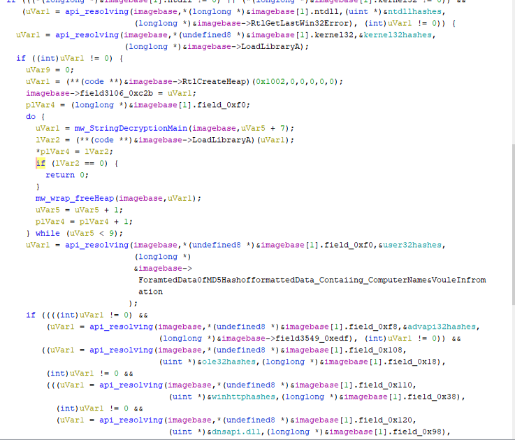

You can use the below code to get the Hashes of the APIs used in Third Stage

```
def stage3ApiHashing():
    api_list = []
    hasher = 0
    for api in api_list:
        hasher = 0
        for i in api:
            i = ord(i)
            i =  i & 0xdf
            saved_val = i
            hasher = hasher ^ saved_val
            hasher = rol(hasher, 8)
            hasher  =  hasher & 0xFFFFFFFF
            hasher  = hasher + saved_val
            hasher  =  hasher & 0xFFFFFFFF
        hasher  =  hasher ^ 0x38127ba6
        hasher  =  hasher & 0xFFFFFFFF
        print(hex(hasher))
        hasher2 = hex(hasher)[2:-1]
        while len(hasher2)!= 8:
            hasher2 = "0"+hasher2
        print(api+" : "+hex(hasher))            
        

```


### Encrypted Strings

The Important Strings in the third Stage are Encrypted in a custom rc4 encryption algorithm. The Encrypted string is Stored in the Format of DataSize:Data

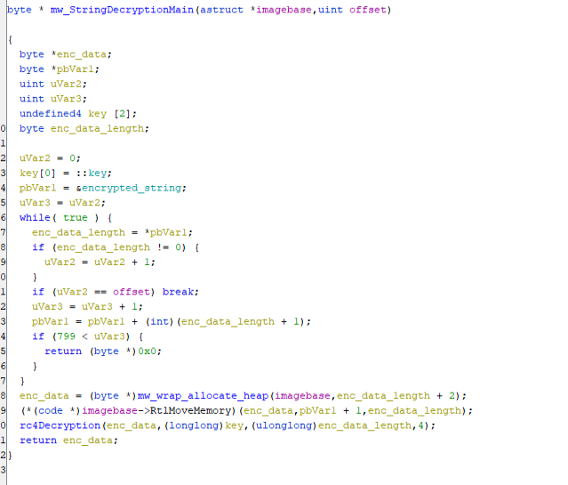

When it Comes to the custom rc4 algorithm. The key Stream Generation is Different from the default rc4 algorithm the below image shows the decompiled view of the custom rc4 decryption algorithm

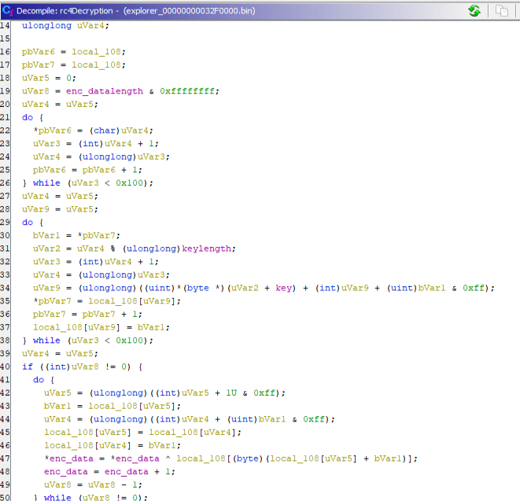

I Have Converted it to python Here is the code to Decrypt the Strings


```
def key_scheduling(key):
    sched = [i for i in range(0, 256)]
    
    i = 0
    for j in range(0, 256):
        i = (i + sched[j] + key[j % len(key)]) % 256
        
        tmp = sched[j]
        sched[j] = sched[i]
        sched[i] = tmp 
    return sched

def streamXor(data, key, data_len,key_len, shed): 
    counter = 0
    i = 0
    j = i
    while data_len != 0:
      i = i+1
      i = i & 0XFF
      temp = shed[i]
      temp = temp & 0xFF
      j = j + temp
      j = j & 0xFF
      shed[i]  = shed[j]
      shed[j] = temp
      shed_swap = shed[i] + temp
      shed_swap = shed_swap & 0xFF
      data[counter] = data[counter] ^ shed[shed_swap]
      counter = counter +1
      data_len = data_len -1

    return data

def customrc4(data, key, data_len,key_len):
    shed = key_scheduling(key)
    final_result = streamXor(data, key, data_len,key_len, shed)
    print(final_result)


def main():
    data = bytearray(b'\xb2\x16\x17\x9f\x23\x37')
    key =  b'\x29\xc5\xbd\xe6'
    customrc4( data, key, 6, 4)

main()
```

The Decrypted Strings of the Third Stage can be seen in the Below Image

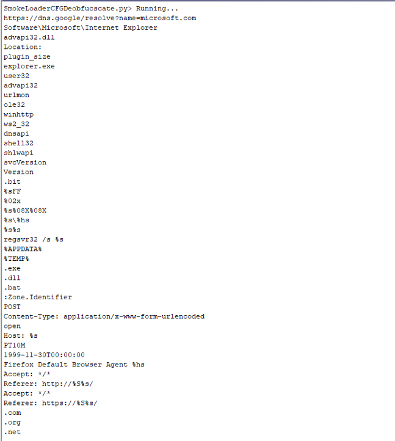

### Analysis Tools Check

This Stage Checks if the system is running Analysis tools by looking at the Process name and Window Class name

In the Below Image you can see the Malicious process Gettting the Name of all the Processes running, Calculates their Hashes using the algorithm used in Stage 3(ROL8 hashing ) and Check it against Hashes of Analysis tools shown in the image below. If they match, that Process is Terminated

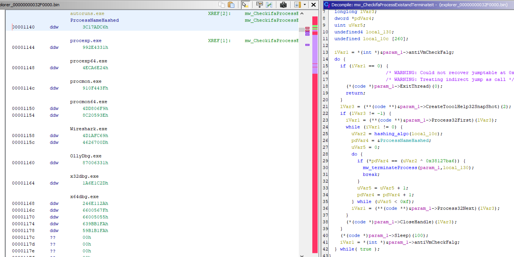

There is an Additional Check Which get the Class Name of all top-level windows on the screen. It then Calculates their Hashes using the algorithm used in Stage 3(ROL8 hashing ) and Check it against Hashes of Analysis tools shown in the image below. If they Match, the Process related to that window is Terminated

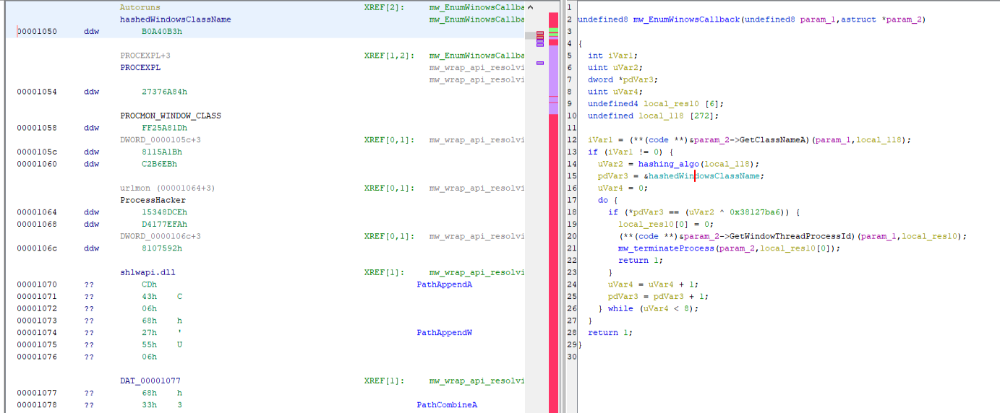

###  Previliges Check

The Same Previliges Check done in Stage 2 is done again Stage 3. The Malware Check if it's running with Higher Prviliges using this API Call's OpenProcessToken->GetTokenInformation(TokenIntegrityLabel)->GetSidSubAuthority
It is Checking if the Integrity level is above  0x2000 (SECURITY_MANDATORY_MEDIUM_RID )
If the values greater than 0x2000, it is  high integrity. If the user is local admin, but a process was executed normaly, you have the medium integrity Level. If the user clicks run as administrator you would have 0x3000.

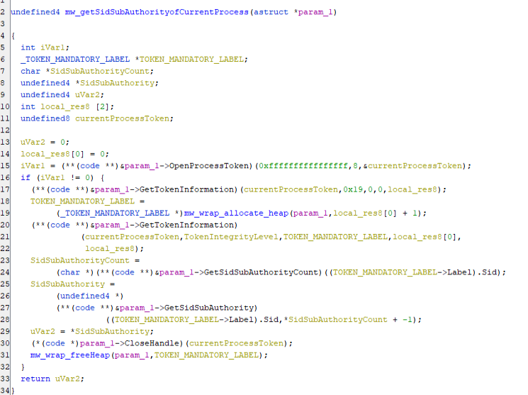


### Mutex Check

The Malware Uses the Computer Name and Volume Infromation to a Create a Formatted Data which is used as a Seed to Create an MD5 Hash with these Values. These Values is used in Multiple Places

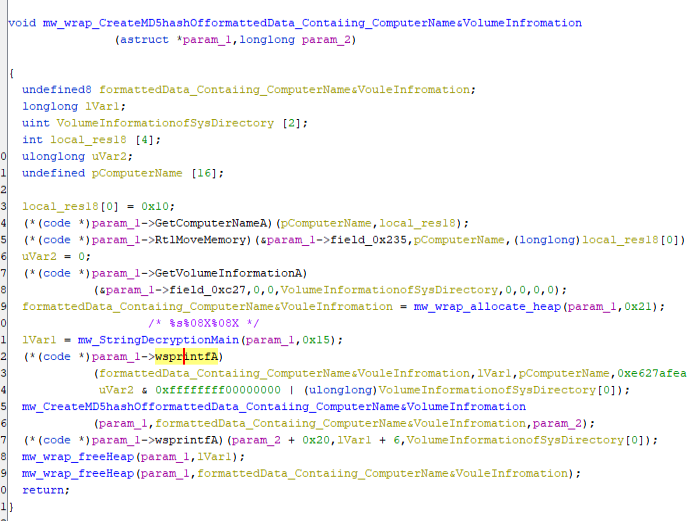

One of the most important Place these Value used is to Create a Mutex with this name. The Malware Creates a Mutex with this name and After that uses RtlGetLastWin32Error , if the return value is ERROR_ALREADY_EXIST Malware Exits the Thread. This is done by the malware to make sure the malware is run only once in a System

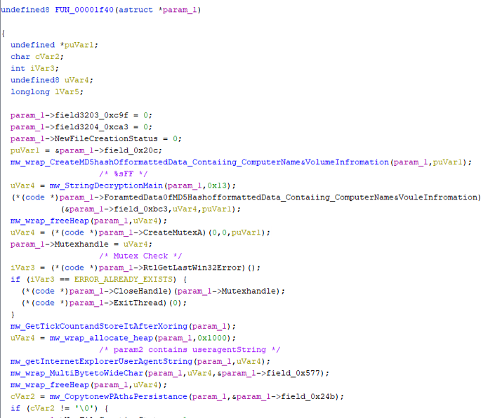

### Copy to New Path and use of Zone.Identifier 

The Malware Creates a File Path at AppData or Temp  . Check if the File running is in this Path. If it is not Running on this path it Delete itself and Copy the File from Curent Location to the File Path Created at AppData or Temp

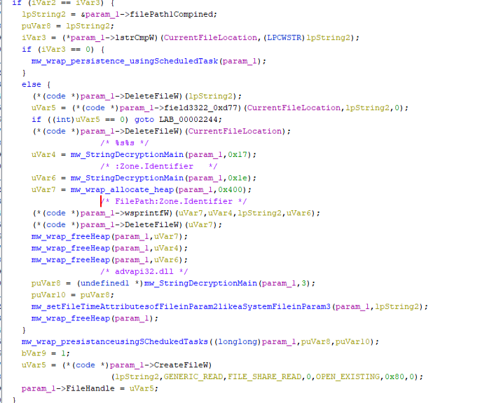

One Important thing to note here is the Malware Also removes the Alternate Data Stream :Zone.Identifier . It Stores the Data whether the file was downloaded from the Internet. By Doing this System won't Understand the File was downloaded from Internet 


### Changing File Attributes and FileTime

After Moving the File to Appdata or Temp . The Files Attribute is Changed to 6 ( FILE_ATTRIBUTE_SYSTEM  | FILE_ATTRIBUTE_HIDDEN). This makes the File Hidden and operating system uses a part of, or uses this File exclusively.

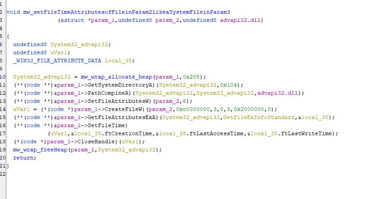

Then Malware Chnages the Malicious Files Creation Time , Last Access Time and Last Write Time to the Creation Time , Last Access Time and Last Write Time of advapi32.dll in System Dir. My Assumption for this Technique is that it is trying to not show it's a New File


### Persistance

The Persistance is Achieved by Creating a Scheduled task using ITaskService interface

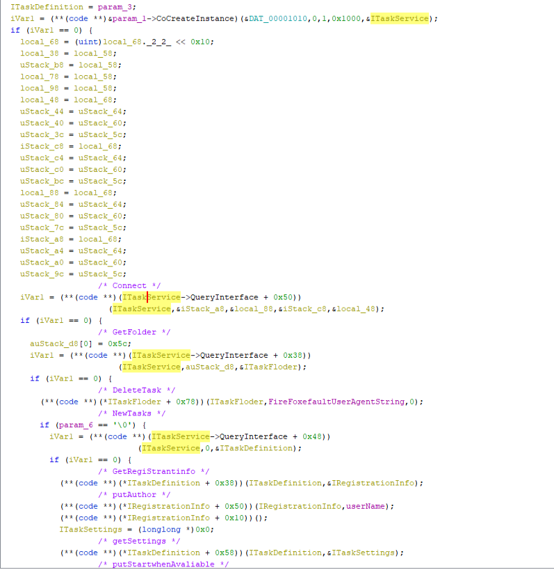

First it Deletes the Task with Name FireFox Default Browser Agent{MD5 Value Used to Create Mutex} . Then It Sets Author  of the task as Current User. Then Trigger of the task is set when the Current User Logins in. The File path of Task is Set to the Malicious File Copied to AppData or Temp
 And It Finally Registers the task with name FireFox Default Browser Agent{MD5 Value Used to Create Mutex} 


### C2 Decryption and Communication

The C2 URL's are Encrypted using the Same Custom rc4 encryption Algorithm used in Stage3. The Data is also Stored in the Same format DataSize:Data. You can use the Same Decryprtion Function mentioned above to decrypt the Strings

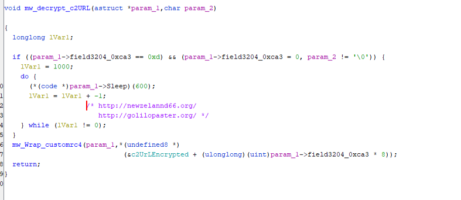

Here is the List of C2 URL's i found in this Malware

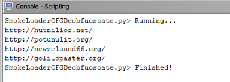


The malware then uses the c2 URL with WinHttp Library to Communicate to the C2 server 
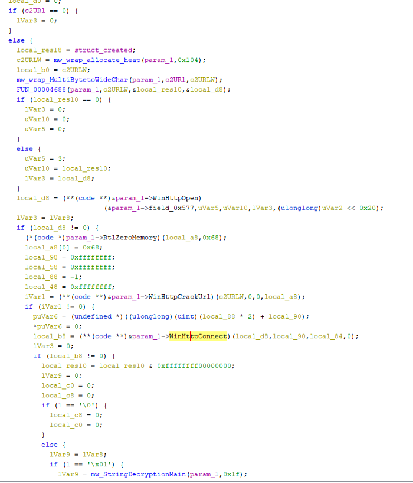

 
Since It's a Loader Based on C2 Response It Loads the Final Payload


 


## Indicators of Compromise

| Type   | Indicator                                                        | Description                |                                                
| ------ | ---------------------------------------------------------------- | ---------------------------|
| SHA256 | 5c1735b8154391534f98e6399a2576a572c7fd3c51fa6ecc097434c89053b1f7 | Initial File               |                                
| CnC    | hxxp://potunulit[.]org/                                          | Command and Control        |                                                 
| CnC    | hxxp://hutnilior[.]net/                                          | Command and Control        |                                                 
| CnC    | hxxp://golilopaster[.]org/                                       | Command and Control        |                                                
| CnC    | hxxp://newzelannd66[.]org/                                       | Command and Control        |                                                 


## References

1) [hsauers5](https://gist.github.com/hsauers5/491f9dde975f1eaa97103427eda50071) 
2) [CryptDeriveKey](https://twitter.com/CryptDeriveKey)
3) [Bing AI Image Generator](https://www.bing.com/images/create) 

 
