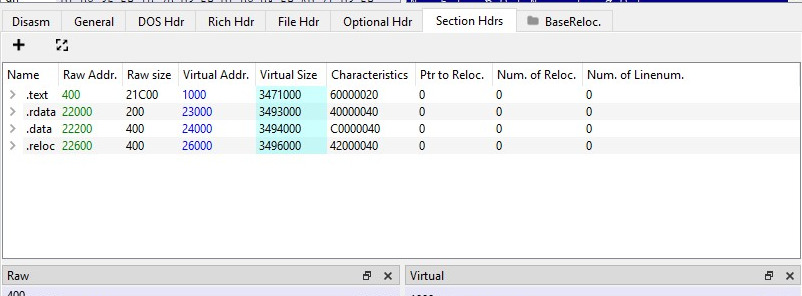
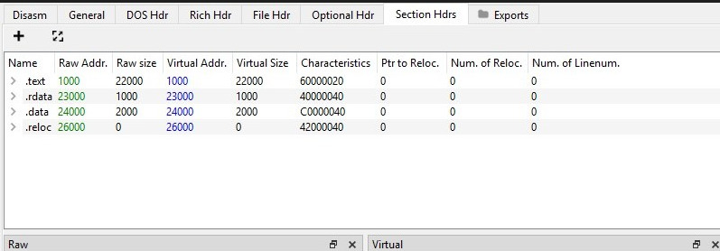
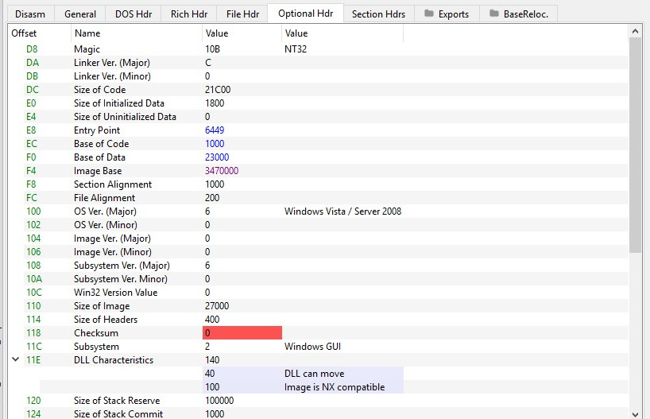

Hi all, Today I am writing this Post to help you fix the common  problems faced while unpacking malware
They are 
1) Unmapping PE files
2) Fixing Alignment and Fixing corrupted/Missing PE Header

First we will be Discussing how to Unmap PE file

## Unmapping PE files
 While Unpacking malware we dump the mapped binary into file. For proper analysis we need to convert this to an Unmapped Binary. We can make sure that the binary is mapped by looking at the raw address of first section, it will be always 1000 . For unmapped binaries the first section starts at 400. The tools we will be using are [PE-bear](https://github.com/hasherezade/pe-bear-releases) and [HxD](http://mh-nexus.de/hxd)

 
**Steps**

 1) Open the File in PE-bear go to the Section Hdrs tab
 
 2) Make the Raw address  match the Virtual address of Sections 
 3) Set the Raw size and Virtual size correctly using  this formula Raw size of Section n = VA of section n+1 - VA of section n Ex : Raw size of first Section(.text 22000) = Virtual Address of Section 2 (.rdata = 23000) -  Virtual Address of Section 1 (.text = 1000) 
 4) Follow this formula for all Other section except reloc
 5) Make the Virtual Size  match the Raw size for all sections except reloc
 6) Make reloc size 0 Because reloc section only exist in disk . since we have dumped the pe from memory it won't have reloc section
  
 7) Go to Optional Header tab and make sure the image base is same as the packed binary's image Base
 8) This is the Final Unmapped PE. Save It
  

## Fixing Alignment and Fixing corrupted/Missing PE Header

 While Unpacking malware some malware authors corrupt the PE headers of unpacked sample. So after Dumping the memory we need to add PE header to the file 

**Steps**

1)  First add the correct PE header : Look for 4c 01 / 64 86 (CPU architecture in optional header ) open the corrupted file and a known good PE  file and copy and paste the PE header of good file ( till 4c0 1 / 64 86) using HxD to the corrupted file ( till 4c 01 / 64 86) 
2)  Check and fix section alignment : Move to raw address of  Section 1 .Is the byte zeroed out correctly till the start ,if not add null (00) bytes till the start of section 1 using HxD

## References

1) [OALabs](https://www.youtube.com/watch?v=WthvahlAYFY)
2) [exploitreversing](https://exploitreversing.com/2021/12/03/malware-analysis-series-mas-article-1/)

 
