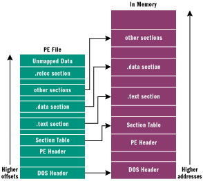
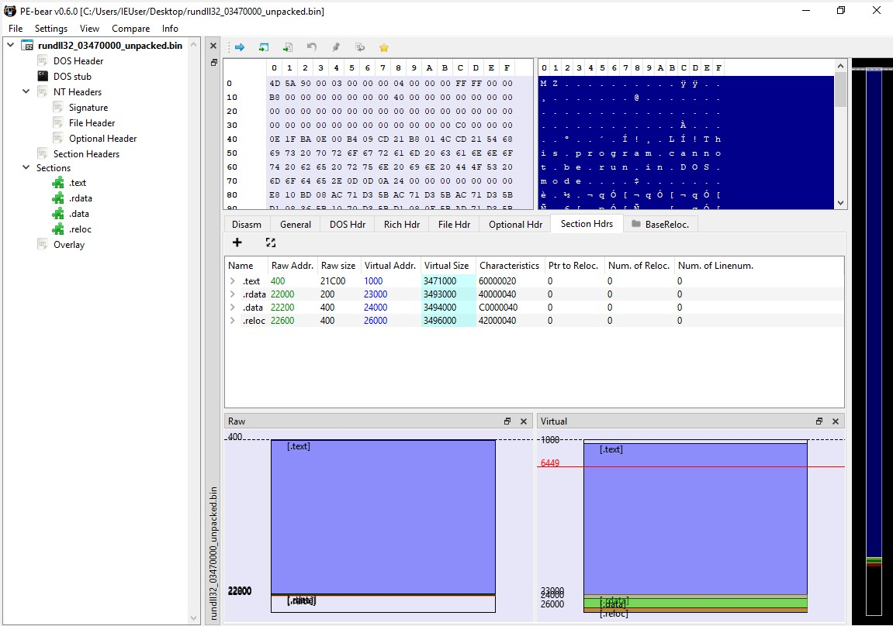
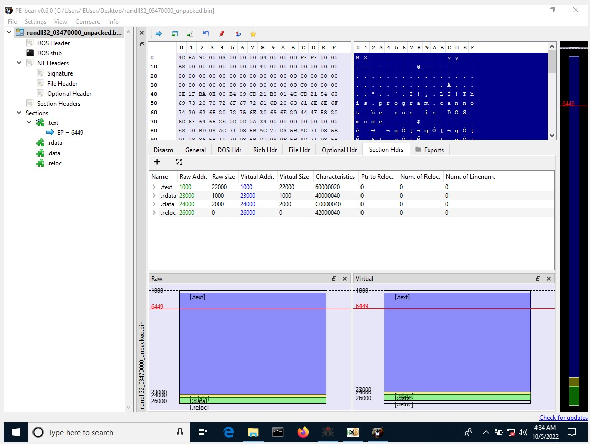
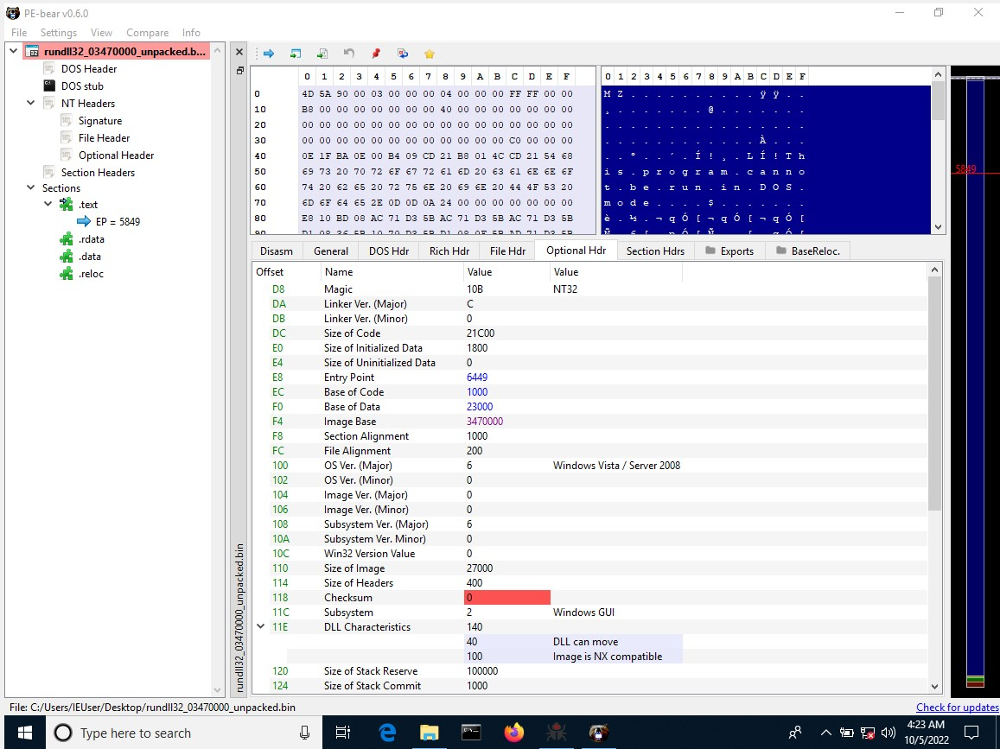

Hi all, Today i am writting this Post to help you from the common  problems faced while unpacking malware
They are 
1) Unmapping PE files
2) Fixing Alignment and Fixing corrupted/Missing PE Header

First we will be Discusiing how to Unmap PE file

## Unmapping PE files

 While Unpacking malware we dump the mapped binay into file.For proper anaylsis we need to convert this to an Unmapped Binary. We can make sure that the binary is mapped by looking at the raw address of first section. it will be always 1000. for unmapped binaries the first section starts at 400. The tools we will be using are [PE-bear](https://github.com/hasherezade/pe-bear-releases) and [HxD](http://mh-nexus.de/hxd)

 
### Steps

 1) Open the File in PE-bear go to the Section Hdrs tab
  
 2) Make the Raw address  match the Virtual address of Sections 
 3) Set the Raw size and Virtual size correct using  this formula Raw size of Section n = VA of section n+1 - VA of section n Ex : Raw size of first Section(.text 22000) = Virtual Address of Section 2 (.rdata = 23000) -  Virtual Address of Section 1 (.text = 1000) 
 4) Follow this formula for all Other section except reloc
 5) Make the Virtual Size  match the Raw size for all sections except reloc
 6) Make reloc size 0 Because reloc section only exist in disk . since we have dumped the pe from memory it won't have reloc section
 
 7) Go to Optional Header tab and make sure the image base is same as the packed binary's image Base
 
 8) This is the Final Unmapped PE. Save It

## Fixing Alignment and Fixing corrupted/Missing PE Header

### Steps

1) first add the correct pe header : look for 4c 01 (cpu architecture 386 in optional header ) open the corrupted file and a known good file and copy and paste till 4c01 (use HxD)
2)  check and fix section allignment : move to raw address of  section  1 . is the byte zeroed out correctly till the start if not add 00 bytes till the start example  of adding 00 using hxd

##References

1) [OALabs](https://www.youtube.com/watch?v=WthvahlAYFY)
2) [MAS](https://exploitreversing.com/)

 
