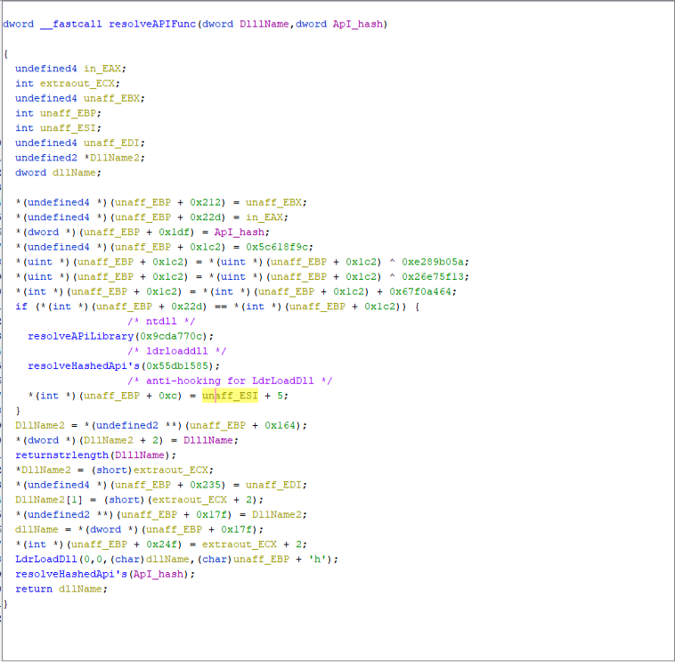
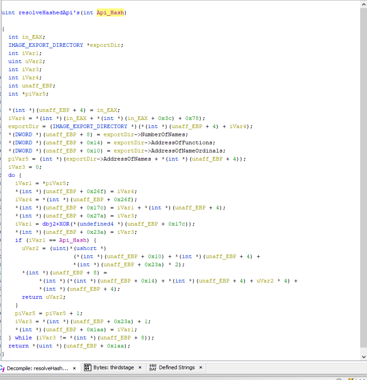
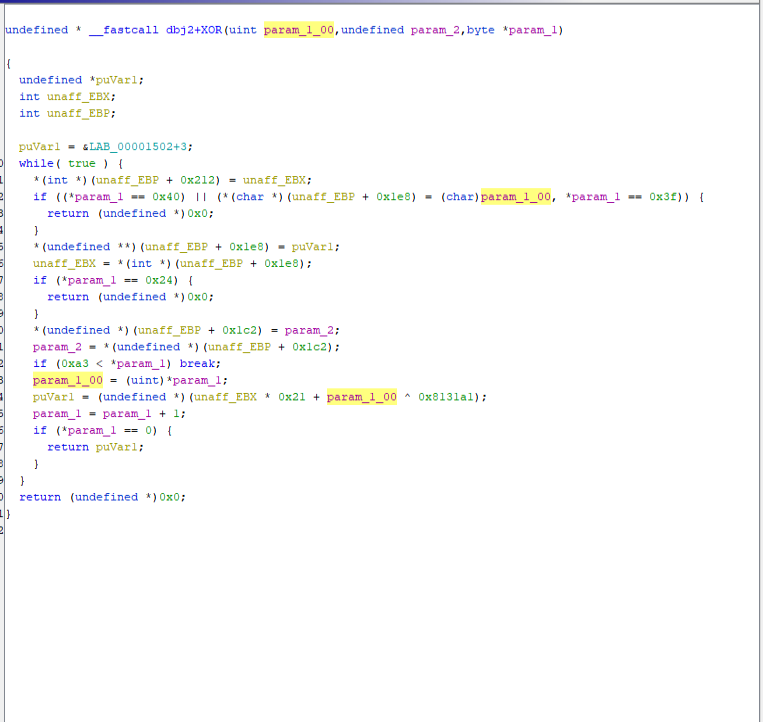
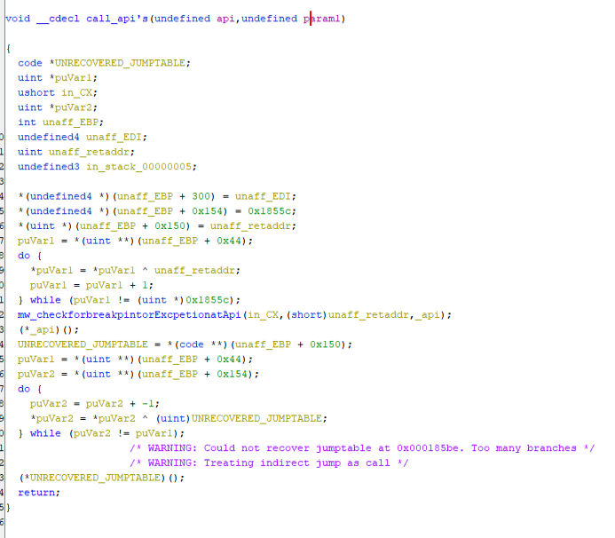
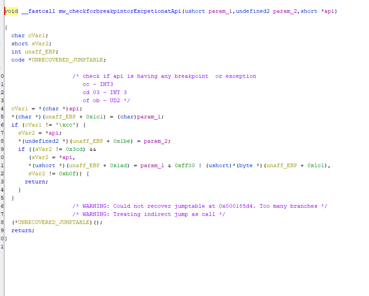
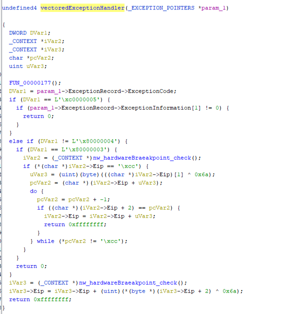
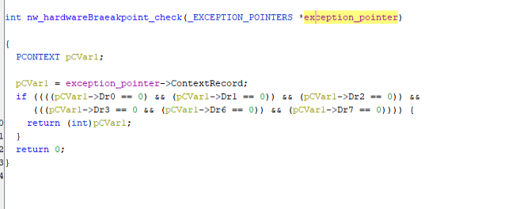
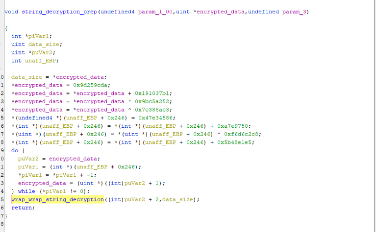
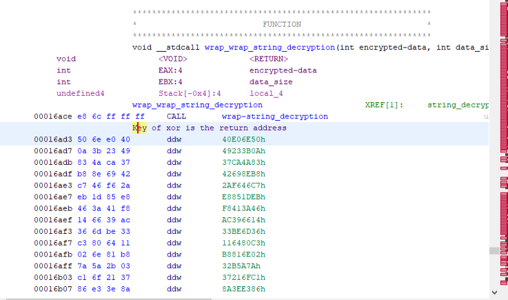
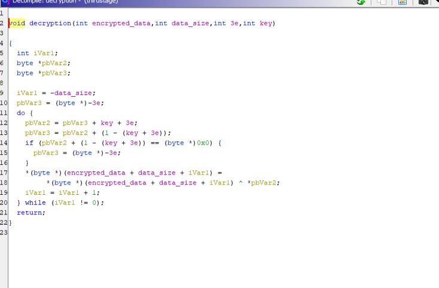

# Guloader Deobfuscation using Ghidra

## Introduction
Hi all, Today we will be Analyzing Guloader  Shellcode using Ghidra. Our Objective is to Identify some Anti-analysis and Obfuscation techniques used by Guloader and Defeat it using Automation

## Anti-Analysis / Obfuscation

### API Hashing
The Shellcode is using API hashing to hide API's being called. For Each API Resolving it first resolves [LdrLoadDll](https://malapi.io/winapi/LdrLoadDll) add 5 to it's address to avoid any Hooking done by EDR . It then use this address to Load the DLL. after Loading the DLL . it resolves the hash of the API it needs to call


API Hashing function is the same as we see in the wild. it goes to the Export Directory of the DLL Loaded and performs Hashing of all API name's till the hashes match .if the hashes match it stores the Address of the API
 
 
 Hashing Algorithm : In the past Guloader was using just DJB2 hash . Now it xors the result of djb2 hash with a hardcoded value to perform API Hashing


I wrote a python script to identify the Hashes of the API's used by the past Guloaders to identify the Functionalities of the Code

```python
val = 0x1505
APIstrings = ["NtGetContextThread", "RtlAddVectoredExceptionHandler", "NtAllocateVirtualMemory", "DbgUIRemoteBreakIn", "LdrLoadDll", "DbgBreakPoint", "EnumWindows", "NtSetInformationThread", "ZwSetInformationThread", "TerminateProcess", "ExitProcess", "NtSetContextThread", "NtWriteVirtualMemory", "NtCreateSection", "NtMapViewOfSection", "NtOpenFile", "NtSetInformationProcess", "NtClose",
             "NtResumeThread", "NtProtectVirtualMemory", "CreateProcessInternal", "GetLongPathNameW", "Sleep", "NtCreateThreadEx", "WaitForSingleObject", "TerminateThread", "CreateFileW", "WriteFile","ReadFile","ShellExecuteW",
             "RegCreateKeyExA","RegSetValueExA", "NtQueryInformationProcess", "InternetOpenA", "InternetSetOptionA", "InternetOpenUrlA", "InternetReadFile", "InternetCloseHandle"]

for APIstring in APIstrings:
    val  = 0x1505
    for ch in instring:
        val += ((val <<5))
        val &= 0xFFFFFFFF
        val += ord(ch)
        val &= 0xFFFFFFFF
        val ^= 0x8131A1
    print(APIstring+" :  "+hex(val))
```

### Checks before Calling API's

Before Calling the API it performs some Checks to make sure it is not being Debugged 


It compares the first few bytes of the API address with a) CC b) INT 3 c) UD2 to check if it's being Debugged. if this is not the case it calls the API


### Control Flow Obfuscation using Vectored Exception Handling

To Obfuscate the Control Flow it uses RtlAddVectoredExceptionHandler to register a vectored Exception Handler. If the Exception raised is any of below three cases it changes the EIP by an XOR operation

1) EXCEPTION_ACCESS_VIOLATION while accessed memory Address is 0
2) EXCEPTION_SINGLE_STEP (Single Stepping )
3) EXCEPTION_BREAKPOINT (Software Break Point - CC)

If it is EXCEPTION_BREAKPOINT it calculates the value of the EIP by this expression EIP = EIP + *(EIP+1) ^ 6A (Changes with sample) 

If it is EXCEPTION_ACCESS_VIOLATION or EXCEPTION_SINGLE_STEP  it calculates the value of the EIP by this expression EIP = EIP + *(EIP+2) ^ 6A (Changes with sample) . 


In the Vectored Exception Handler function it also checks if any Dynamic anyalsis is being performed by Checking if any hardware breakpoint is set using ContextRecord a member of [_EXCEPTION_POINTERS](https://learn.microsoft.com/en-us/windows/win32/api/winnt/ns-winnt-exception_pointers)


To Understand Vectored Exception in Detail i would suggest to read this [article](https://www.mcafee.com/blogs/other-blogs/mcafee-labs/guloader-campaigns-a-deep-dive-analysis-of-a-highly-evasive-shellcode-based-loader/) 

### Encrypted Strings

All the Important strings including the C2 URL is Encrypted using XOR. The Encrypted strings are created by Performing a lot of Mathematical Expression(not Hardcoded).After Encryption String is Fully Created . The first Dword contains the length of the Encrypted string. then what follows is the Encrypted string. The Address of the Encrypted string is given as parameter to the String Decrpyion preperation Function. It store the Encrypted String length in a Varaible. And changes the First Dword to a Dummy Value . After that increments the Address of Encrypted String by a dword now it points to the Actual start of the String. Encrypted_string and the Encrypted String length is given an paramerers to the next Function called which is a wrapper around the string decryption function


The wrapper function passes the Encrypted_string, Encrypted String length and the Key. The key is actually stored in the return address of the wrapper function


The Decrytion Algorithm is a Simple XOR were Encrypted string is calculated by Mathematical Expression and key is stored in the the return address of the wrapper function


## Automation using Ghidra API's

Analyzing the shellcode dynamically will be very tiring because it has multiple checks for Anti-Analysis . Static Analysis will also take much time due to Control Flow Obfusucation. So I wrote 2 Scripts to help in this Analysis . one is to Deobfuscate the Control Flow and the other is to Decrypt the Strings

Please Follow the Below Steps to Reduce your time on Guloader

1) Import the Shellcode to Ghidra
2) Disassemble (Key Binding D) the Start of the Shell code
3) Run the [Guloader_deobfusucate.py](https://github.com/irfan-eternal/blog_temp/blob/main/guloader/Guloader_deobfusucate.py) script Providing the Decryption Key and key for EIP modification
4) Run the [Gu_string_decryption.py](https://github.com/irfan-eternal/blog_temp/blob/main/guloader/Gu_string_decryption.py) script Providing the Decryption Key

**NOTE:** For Both Cases Provide the keys as Hex String with out Ox Example if the key is 0x6A Provide it as 6A. My Scripts are not the best way to Achieve this . Note to Self need to improve to write better code

After these Steps the Control Flow will be Deobfusucated and Decrypted Strings and Payload key will be printed in the Console . If you have a closer look at the below image you will see the C2 URl will not be starting with http:// this is to prevent it from XOR Bruteforcing


I Have only Checked one sample with the scripts .Feel free to use it with Other Guloader Shell Code and let me know if you are able to see the Decrypted strings

## References

1) [SonicWall](https://securitynews.sonicwall.com/xmlpost/guloader-demystified-unraveling-its-vectored-exception-handler-approach/) 
2) [CheckPoint](https://research.checkpoint.com/2023/cloud-based-malware-delivery-the-evolution-of-guloader/) 
3) [AnyRun](https://any.run/cybersecurity-blog/deobfuscating-guloader/)


 

