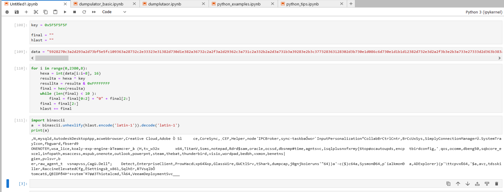

# Malware String Decryption in 2 ways


Hi all, Today I am writing a blog about Decrypting malware strings using 2 ways. I  have posted a [tweet](https://twitter.com/irfan_eternal/status/1647222309319593987) about this 2 days ago .
The 2 Ways are
1) Emulating
2) Scripting


##  Emulating


 For Emulation i used the tool [dumpulator](https://github.com/mrexodia/dumpulator) by [mrexodia](https://twitter.com/mrexodia). To use the tool we needed to find the decryption function, it's calling Convetion and the parameters being passed
 
 
 
 in this Example the function uses __fastcall calling convention and it has 4 parameters first 2 parameters are in ECX, EDX. the last parameters are pushed to the stack. with this understanding i wrote a small snippet for emulation
 
 ```python
 from dumpulator import Dumpulator
dp = Dumpulator("loki.dump", quiet = "TRUE" )

dp.regs.ecx = 0x004eac00
dp.regs.edx = 0x30f
dp.call(0x004b9b50,[0x004f8a4c, 0x004f8a34 ])

decrypted_string = dp.read(0x004eac00, 0x30f)
print(decrypted_string.decode('latin-1'))
```
First i loaded the PE file in x64dbg. Ran untill Entrypoint. and took a minidump.The minidump command has been integrated into x64dbg since 2022-10-10. To create a dump, pause execution and execute the command MiniDump <fullpath_to_store_dmp>

I set  ECX and EDX register using dp.regs.<register_name>. The call method is having 2 arguments 1st argument is the function to be called. 2nd arguemnt is an array containning parameters of the function pushed to stack.read method has 2 arguments. 1st argument is the address to read data from. 2nd argument in the size of the Data 
 

 
 

## Scripting

 I used python to decrypt the strings. I opened the PE File in Ghidra and Visited the decryptor function . it was using a simple XOR operation
 
 
 
 ```python
 import binascii

key = 0x5F5F5F5F
final = ""
hlast = ""
data = "5928270c3a2d293a2d73bf5e5fc109363a28732c2e33323e31382d730d1e382a36732c2a2f3a2d29362c3a731c2a332b2a2d3a731b3a39283e2b3c377328363128302d3b730e1d086c6d730e1d1b1d12382d732e3d2a2f3b3e2b3a733e27333d2d363b383a73372b2b2f3b73393b333e2a313c373a2d73122c1b2b0c2d292d73353e293e736c696f2c3a736c696f3b303c2b302d73283b2c28392c3e393a73393b37302c2b73181b2c3c3e317305372a1b303138193e3138062a730e1d1b23525f73117332262c2e333b731e2a2b303b3a2c341b3a2c342b302f1e2f2f733e3c283a3d3d2d30282c3a2d731c2d3a3e2b36293a7f1c33302a3b731e3b303d3a7f8d5a7f0c3343563c3a731c302d3a0c26313c73e75c531c1a1973173a332f3a2d7331303b3aeb5d5f5c160f1c1d2d30343a2d732c26313c722b3e2c343d3e8c5e28302d3f5c5f5d16312f2a2b0f3a2d2c30313e3336253e2b363031ef585c1c3033333e3dd7535f451d2d1c2b2d331c312b2d731d2d1c3c0a270c262c730c36322f33261c3031313a3c2b363031123e313e383a2d835d5f54710c262c2b3a320b2d3e26163c303173393d382a3e2d3b73393d2c3a2d3b665510111a11100b1a1273282c3e00335d5f5c363c3a7334303e3326723a272f723a313836313a72bf5c5e0b3a3e3230613a2d00bf7f77175f5b732b2900286c6d275f5f5627696b730b362b3e3109730c2c322c7331302b3a2f3e3b730d3b2d3b7b5f5a2c3e3273302d3e3c333a73303c2c2c3b733b3d2c31322fc77c5f5c2b36323a733e38312b2c293c73362c2e332f332a2c315e2739275f2d47322624692b302fa74d54303c3e2a2b302a2f3b2c733a313c2f5a562b3d362d3b3c30313936387378e75f5f582e302c73303c303232733b3d3a31386a6f732c2e3d3c302d3aa3575f003a273c3a3373363139302f3e2b3773322c3e3c3c3a2c2c73322c2f2a3d7330313a31302b3a73302a2b33303034732f30283a2d2f312b732c2b3a3e32732b373a3d3e2b732b372a313b3a2d3d362d3b7329362c36307328302d3b2f3e3b733d3a3b3d37732927323031733d3a313a2b312c235f5538363a31732f29332c292d733dd74e553a2d732d3e28003e383a312b002b4656292c313e2f292c2c731c3e38a3715e1b3a3333ef645f561b3a2b3a3c2b731a312b3a2d2f2d362c3a1c33363a312b730f2d302848173e3c3b13cb5e5e272f696be35d5f5b272f7318333e2c2c08362d3a7318081c2b330c2d29732b5e5f5b0c373e2d34733b2a322f3c3e2f73356f38313534306ecb3a5e2d2a312c787d5f696b76765f3e78725f3c777b5f76db5f573c696b3e730c262c323031875f5e696b732f3f4b364d3ed75e335c345d3230318f5cdb5e563e731e1b1a272f33302d3a2d76775f2f5478035f2b545e2b3c2f2927ce805f696b73787b5f5f4d3e733e2925732b3b2c2c343633333a2d730d3e3c3c36313a1a333a293e2b3a3b1c393873975d5a0c3a2b2b3631382cb75b5e00276769b35e5e730c2e33371a5d2d730d0b09dfd35e2c2e333d8bda552b30323c3e2b69730e1d161b0faf6b810174742c412b3a3278435cfb68a75ea75a6c0b5f373659302b3e333c323b730b9f5e5f5c696b73093a3a3e321b3a2f333026323a312b0c293c4e5f5f";

for i in range(0,2380,8):
    hexa = int(data[i:i+8], 16)
    resulta = hexa ^ key
    resullta = resulta & 0xFFFFFFFF
    final = hex(resulta)
    while (len(final) < 10 ):
        final = final[0:2] + "0" + final[2:]
    final = final[2:]
    hlast += final
    
decrypted_string  = binascii.unhexlify(hlast.encode('latin-1')).decode('latin-1')
print(decrypted_string)   
```

The key used was 0x5F5F5F5F. The script basically loops the contents of data to XOR it with the key. NOTE : My Python is not so good. I think it can be done in a better way



## References


1) [mrexodia](https://github.com/mrexodia/dumpulator)
2) [OALabs](https://github.com/OALabs/research/blob/master/_notebooks/2021-07-26-python3_reversing_tips.ipynb)

 

